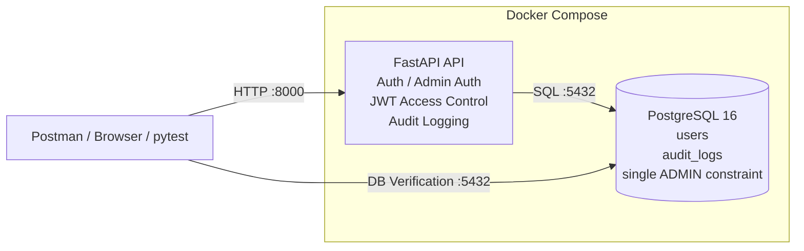

# Technical QA Lab - 테스트 환경 구축 및 실행 가이드

## 1. 문서 목적

이 문서는 `Technical QA Lab` 프로젝트의 테스트 환경을 **왜 이렇게 구성했는지**, 어떤 순서로 구축했는지, 그리고 다른 PC에서 Git 저장소를 받은 뒤 **동일한 테스트 환경과 자동화 테스트를 재현하는 방법**을 정리한 문서입니다.

프로젝트의 목적은 백엔드 서비스를 크게 개발하는 것이 아니라, Technical QA 관점에서 다음 항목을 직접 검증할 수 있는 최소 테스트 대상을 만드는 것입니다.

- API 요청/응답 검증
- 인증 및 접근통제 검증
- 사용자 상태에 따른 동작 검증
- PostgreSQL 데이터 상태 교차검증
- Audit Log 검증
- 정상/예외/권한 시나리오 테스트
- 반복 가능한 테스트 환경 구성
- 핵심 Regression Test 자동화

---

## 2. 구축 목표

초기에는 FastAPI를 Windows의 Python 가상환경에서 직접 실행하고 PostgreSQL만 Docker로 실행했습니다.

```text
[초기 환경]

Windows
├─ Python .venv
│  └─ FastAPI / Uvicorn
│
└─ Docker
   └─ PostgreSQL
```

하지만 이 방식은 다른 PC에서 테스트할 때 Python 버전, 패키지 설치 상태, PostgreSQL 환경 등에 따라 실행 환경 차이가 발생할 수 있습니다.

따라서 최종적으로 API와 Database는 다음과 같이 Docker Compose로 구성했습니다.

```text
[최종 환경]

Docker Compose
├─ FastAPI API Container
└─ PostgreSQL 16 Container
```

Git 저장소를 받은 후 PowerShell에서 `setup.ps1`을 실행하여 API와 Database 환경을 동일하게 구성할 수 있도록 했습니다.

pytest 자동화는 호스트 PC에서 실행되며 Docker Compose로 실행 중인 API와 PostgreSQL을 대상으로 검증합니다.

```text
Windows
│
├─ Python / pytest
│       │
│       ▼
│   HTTP / DB Verification
│
└─ Docker Compose
    ├─ FastAPI API Container
    └─ PostgreSQL 16 Container
```

---

## 3. 환경 아키텍처

GitHub에서는 아래 Mermaid 다이어그램이 자동으로 렌더링됩니다.



### 주요 구성 요소

| 구성 요소 | 역할 |
|---|---|
| FastAPI | 테스트 대상 API 제공 |
| PostgreSQL 16 | 계정 및 Audit Log 데이터 저장 |
| Docker | 실행 환경 격리 |
| Docker Compose | API와 DB를 동일한 구성으로 실행 |
| Postman | API 정상/예외/권한 시나리오 검증 |
| Swagger | 공개 API 구조 확인 및 Smoke Test |
| pytest | 핵심 인증·인가·계정 관리 Regression 자동화 |
| pytest-html | Full Regression 결과 HTML Report 생성 |
| JWT | 관리자 API 인증 및 접근통제 |
| bcrypt | 비밀번호 해시 처리 |
| PowerShell | 테스트 환경 초기 구축 자동화 |

---

## 4. 각 기술을 사용한 이유

### Docker / Docker Compose

API와 PostgreSQL을 PC마다 직접 구성하면 환경 차이가 발생할 수 있습니다.

따라서 FastAPI와 PostgreSQL을 컨테이너화하여 API / DB 실행 환경을 동일한 형태로 구성했습니다.

### PostgreSQL

API 응답만 확인하는 것이 아니라 실제 DB에 저장된 값과 데이터 제약조건까지 교차검증하기 위해 사용했습니다.

주요 검증 대상:

- `username` UNIQUE
- `role` CHECK
- `status` CHECK
- ADMIN 최대 1명 제약
- 계정 상태
- password hash
- Audit Log 저장 여부

### FastAPI

QA 포트폴리오에서 직접 검증할 수 있는 최소 API 테스트 대상을 구성하기 위해 사용했습니다.

이 프로젝트에서 FastAPI 개발 자체가 목적은 아닙니다.

### Postman

Swagger만으로는 JWT Header, 잘못된 토큰, 만료 토큰, 권한별 요청 등의 테스트 시나리오를 관리하기 어렵기 때문에 수동 API 검증과 요청 재현에 Postman을 사용했습니다.

### pytest

반복 회귀 가치가 높은 인증·인가 및 계정 관리 시나리오를 자동화하기 위해 사용했습니다.

API Response뿐 아니라 PostgreSQL 데이터와 Audit Log까지 하나의 테스트 흐름에서 교차검증합니다.

### Audit Log

API가 단순히 `401/403`을 반환하는지만 확인하는 것이 아니라, 인증 및 접근 거부 이벤트가 DB에 기록되는지도 함께 검증하기 위해 구성했습니다.

현재 기록 이벤트:

- `LOGIN_SUCCESS`
- `LOGIN_FAILED`
- `ACCESS_DENIED`

---

## 5. 구축 과정

### Step 1. 프로젝트 기본 구조 구성

```text
technical-qa-lab/
├─ app/
├─ db/
├─ docs/
├─ tests/
└─ docker-compose.yml
```

### Step 2. PostgreSQL Docker 환경 구성

PostgreSQL 16 이미지를 사용하여 DB Container를 먼저 구성했습니다.

초기에는 FastAPI는 Windows에서 실행하고 PostgreSQL만 Docker에서 실행했습니다.

### Step 3. DB Schema 구성

```text
db/
├─ 01_create_users.sql
├─ 02_create_audit_logs.sql
└─ 03_enforce_single_admin.sql
```

- `01_create_users.sql`: 사용자 계정 테이블 생성
- `02_create_audit_logs.sql`: 로그인/접근 거부 이벤트 저장 테이블 생성
- `03_enforce_single_admin.sql`: 두 번째 ADMIN 생성 차단

> 단일 ADMIN 제약은 ADMIN을 **최대 1명**으로 제한합니다.

### Step 4. USER / ADMIN 정책 분리

```text
USER  → /auth/login
ADMIN → /admin/auth/login
```

ADMIN은 일반 USER 로그인 API를 사용할 수 없습니다.

일반 사용자 생성 과정에서는 역할을 입력할 수 없으며 생성되는 계정은 USER로 제한했습니다.

### Step 5. ADMIN JWT 인증 구성

관리자 로그인 성공 시 JWT를 발급하도록 구성했습니다.

관리자 API는 유효한 ADMIN JWT가 있어야 접근할 수 있습니다.

검증 대상:

- 토큰 없음
- 잘못된 토큰
- 만료된 토큰
- 정상 ADMIN 토큰

### Step 6. Audit Log 구성

인증 및 접근 거부 이벤트를 PostgreSQL의 `audit_logs` 테이블에 기록하도록 구성했습니다.

### Step 7. FastAPI Docker화

기존에는 로컬 `.venv`에서 FastAPI를 실행했지만 재현 가능한 API 실행 환경을 위해 FastAPI도 Docker Container로 변경했습니다.

추가 파일:

```text
Dockerfile
requirements.txt
.dockerignore
```

### Step 8. FastAPI + PostgreSQL 통합

`docker-compose.yml`에서 다음 두 서비스를 함께 관리하도록 변경했습니다.

```text
services
├─ db
└─ api
```

FastAPI Container는 PostgreSQL Health Check가 성공한 뒤 시작합니다.

### Step 9. DB 자동 초기화

새 PostgreSQL Volume이 생성될 때 다음 SQL 파일이 순서대로 실행됩니다.

```text
01_create_users.sql
        ↓
02_create_audit_logs.sql
        ↓
03_enforce_single_admin.sql
```

그 후 API Container에서 `db.init_admin`을 실행하여 초기 ADMIN을 생성하고 FastAPI를 시작합니다.

> PostgreSQL의 `/docker-entrypoint-initdb.d` 스크립트는 **새 DB Volume의 최초 초기화 시점에 실행**됩니다.

### Step 10. PowerShell 자동 구축 스크립트 구성

`setup.ps1`은 다음 작업을 수행합니다.

```text
Docker 설치/실행 확인
        ↓
.env 존재 여부 확인
        ↓
.env가 없으면 신규 생성
        ↓
DB 비밀번호 자동 생성
ADMIN 비밀번호 자동 생성
JWT Secret 자동 생성
        ↓
docker compose up -d --build
        ↓
DB / API 실행
        ↓
/db-health 확인
        ↓
환경 구축 완료
```

### Step 11. 테스트 데이터 독립성 개선

초기 자동화 테스트에서는 일부 USER 인증 시나리오가 기존 Database에 미리 생성된 특정 USER에 의존했습니다.

이 경우 현재 PC에서는 테스트가 성공하더라도 신규 Database 환경에서는 필요한 USER가 존재하지 않아 테스트 결과가 달라질 수 있습니다.

이를 개선하여 USER 인증 테스트에서 필요한 계정은 pytest fixture에서 실행 시 동적으로 생성하도록 변경했습니다.

```text
pytest 실행
      ↓
Test USER 생성
      ↓
로그인 / 상태 시나리오 검증
      ↓
Test 종료
      ↓
Cleanup
```

INACTIVE USER 시나리오는 생성된 테스트 USER의 상태를 일시적으로 변경하여 검증한 뒤 원래 상태로 복원합니다.

테스트 종료 후에는 생성된 USER를 Cleanup하여 반복 실행 시 기존 Database 상태에 의존하지 않도록 구성했습니다.

---

## 6. 현재 프로젝트 구조

```text
technical-qa-lab/
├─ app/
│  ├─ main.py
│  ├─ database.py
│  ├─ audit.py
│  ├─ security.py
│  └─ routers/
│
├─ db/
│  ├─ 01_create_users.sql
│  ├─ 02_create_audit_logs.sql
│  ├─ 03_enforce_single_admin.sql
│  └─ init_admin.py
│
├─ docs/
│  ├─ 00_project_plan.md
│  ├─ 01_requirements.md
│  ├─ 02_environment_setup.md
│  ├─ 03_test_coverage.md
│  ├─ 04_automation_strategy.md
│  └─ 05_defects.md
│
├─ testcases/
│  └─ technical-qa-lab_TC.xlsx
│
├─ postman/
│  └─ technical-qa-lab.postman_collection.final.json
│
├─ tests/
│  ├─ data/
│  │  └─ test_data.py
│  ├─ helpers/
│  │  ├─ db_helper.py
│  │  └─ user_helper.py
│  ├─ conftest.py
│  ├─ test_user_auth.py
│  ├─ test_admin_auth.py
│  ├─ test_authorization.py
│  └─ test_users.py
│
├─ reports/
│  └─ full_test_report.html
│
├─ Dockerfile
├─ docker-compose.yml
├─ requirements.txt
├─ requirements-dev.txt
├─ setup.ps1
├─ .env.example
├─ .dockerignore
├─ .gitignore
└─ README.md
```

---

## 7. 다른 PC에서 처음 실행하는 방법

이 절은 새로운 PC 또는 기존 데이터가 없는 환경에서 API / DB 환경과 pytest 자동화를 재현하는 방법을 정리합니다.

### 7-1. 사전 준비

API / DB 환경 구성에 필요한 프로그램:

1. Git
2. Docker Desktop
3. PowerShell

pytest 자동화까지 실행하려면 추가로 다음이 필요합니다.

4. Python
5. 프로젝트 Python Dependency

> PostgreSQL은 PC에 직접 설치할 필요가 없습니다.  
> FastAPI와 PostgreSQL은 Docker Compose에서 실행합니다.  
> 로컬 Python은 pytest 자동화 실행에 사용합니다.

### 7-2. Docker Desktop 실행

Docker Desktop을 실행하고 Docker Engine이 정상적으로 실행되는지 확인합니다.

```powershell
docker --version
```

### 7-3. Git 저장소 Clone

```powershell
git clone <repository-url>
cd technical-qa-lab
```

Private Repository라면 GitHub 인증이 필요할 수 있습니다.

### 7-4. 신규 Clone 상태 확인

GitHub에는 실제 `.env`가 올라가지 않기 때문에 신규 Clone 상태에서는 `.env`가 없어야 정상입니다.

```powershell
Test-Path .env
```

정상적인 신규 Clone이라면:

```text
False
```

가 출력됩니다.

### 7-5. PowerShell 자동 구축 실행

```powershell
.\setup.ps1
```

PowerShell 실행 정책 때문에 차단되는 경우 현재 PowerShell Process에서만 실행 정책을 허용합니다.

```powershell
Set-ExecutionPolicy -Scope Process -ExecutionPolicy RemoteSigned
```

다시 실행:

```powershell
.\setup.ps1
```

### 7-6. 최초 ADMIN 비밀번호 기록

신규 환경에서는 `setup.ps1`이 다음 값을 자동 생성합니다.

- PostgreSQL Password
- ADMIN Password
- JWT Secret

ADMIN Password는 초기 실행 화면에 표시되므로 Postman 테스트에 사용할 수 있도록 별도로 기록합니다.

> 실제 비밀번호와 JWT Secret은 GitHub에 Commit하지 않습니다.

### 7-7. pytest Dependency 설치

pytest 자동화를 실행하려면 프로젝트 루트에서 Python Dependency를 설치합니다.

```powershell
python -m pip install -r requirements-dev.txt
```

설치가 완료되면 Python에서 프로젝트의 테스트 모듈과 필요한 Library를 사용할 수 있습니다.

---

## 8. 자동 구축 후 확인 순서

### 8-1. Container 상태 확인

```powershell
docker compose ps
```

정상 예시:

```text
technical-qa-db    Up (healthy)
technical-qa-api   Up
```

### 8-2. DB 연결 Health Check

```powershell
Invoke-RestMethod http://127.0.0.1:8000/db-health
```

정상 결과 예시:

```text
status   : ok
database : qa_lab
user     : qa_user
```

이 결과가 정상이라면 다음 연결이 확인된 것입니다.

```text
PC
 ↓
FastAPI Container
 ↓
PostgreSQL Container
```

### 8-3. Swagger 확인

브라우저에서 접속:

```text
http://127.0.0.1:8000/docs
```

현재 관리자 API는 Swagger Schema에서 숨겨져 있으므로 일반 공개 API만 표시되는 것이 정상입니다.

### 8-4. ADMIN 로그인 확인

관리자 인증은 Postman에서 확인합니다.

```text
POST /admin/auth/login
```

초기 실행 시 생성된 ADMIN 계정 정보를 사용합니다.

정상 로그인 시 ADMIN JWT가 반환됩니다.

### 8-5. pytest Full Regression 실행

프로젝트 루트에서 실행합니다.

```powershell
python -m pytest .\tests -v
```

현재 Full Regression 기준 결과:

```text
10 Passed
0 Failed
0 Errors
```

`pytest -v`가 아닌 `python -m pytest` 방식으로 실행하여 프로젝트 루트의 Python Module 경로를 기준으로 테스트를 실행합니다.

---

## 9. 신규 Database 환경 재현 검증

자동화 테스트가 기존 Database 데이터에 의존하지 않는지 확인하기 위해 PostgreSQL Volume을 제거한 신규 환경에서도 Full Regression을 수행했습니다.

### 9-1. 기존 Container 및 Database Volume 제거

```powershell
docker compose down -v
```

> `-v` 옵션은 기존 PostgreSQL 데이터를 삭제합니다.  
> DB 초기화 테스트처럼 삭제를 명확하게 의도한 경우에만 사용합니다.

### 9-2. 신규 환경 구축

```powershell
.\setup.ps1
```

신규 PostgreSQL Volume에서 Schema와 초기 ADMIN이 다시 생성됩니다.

### 9-3. Full Regression 실행

```powershell
python -m pytest .\tests -v
```

검증 결과:

```text
10 Passed
0 Failed
0 Errors
```

이를 통해 사전에 생성된 일반 USER가 없는 신규 Database에서도 pytest fixture가 테스트에 필요한 USER를 생성하고, 테스트 종료 후 정리하면서 전체 Test Suite가 정상 실행되는 것을 확인했습니다.

```text
New Database
      ↓
ADMIN Initialization
      ↓
pytest
      ↓
Dynamic Test USER Setup
      ↓
Authentication / Authorization / USER Lifecycle
      ↓
Cleanup
      ↓
10 Passed
```

---

## 10. HTML Test Report 생성

최종 Regression 결과는 `pytest-html`을 사용하여 HTML Report로 생성합니다.

프로젝트 루트에서 다음 명령을 실행합니다.

```powershell
python -m pytest .\tests -v --capture=tee-sys --html=.\reports\full_test_report.html --self-contained-html
```

`--capture=tee-sys`를 사용하여 USER Lifecycle 내부의 `[PASS]`, `[FAIL]`, `[CLEANUP]` 출력을 터미널과 HTML Report에서 함께 확인할 수 있도록 했습니다.

생성 결과:

```text
reports/
└─ full_test_report.html
```

---

## 11. 환경 종료 및 재실행

### 일시 정지

데이터를 유지하면서 Container만 중지합니다.

```powershell
docker compose stop
```

### 다시 실행

```powershell
docker compose start
```

또는 설정 변경 후:

```powershell
docker compose up -d
```

### Container 제거

```powershell
docker compose down
```

일반적인 `down`은 Container와 Network를 제거하지만 Named Volume은 유지합니다.

### 주의: DB 데이터까지 삭제

```powershell
docker compose down -v
```

`-v` 옵션은 PostgreSQL Volume을 삭제하므로 기존 계정, Audit Log 등 테스트 데이터가 삭제됩니다.

**DB 초기화를 명확하게 의도한 경우에만 사용합니다.**

---

## 12. 문제 발생 시 확인 방법

### Python에서 프로젝트 Module을 찾지 못하는 경우

프로젝트 루트에서 다음과 같이 실행합니다.

```powershell
python -m pytest .\tests -v
```

예를 들어 다음과 같은 오류가 발생하는 경우:

```text
ModuleNotFoundError: No module named 'app'
```

현재 위치를 확인합니다.

```powershell
pwd
```

다음 프로젝트 루트에서 테스트를 실행해야 합니다.

```text
technical-qa-lab
```

### API Container가 바로 종료되는 경우

```powershell
docker compose ps -a
```

종료되어 있다면:

```powershell
docker compose logs api
```

### DB Log 확인

```powershell
docker compose logs db
```

### 전체 Log 확인

```powershell
docker compose logs
```

### 8000 또는 5432 Port 충돌

```powershell
docker ps
```

기존 환경이 이미 실행 중이라면 같은 Port를 사용하는 두 번째 환경을 동시에 실행할 수 없습니다.

---

## 13. 환경변수 및 보안 관리

실제 환경변수는 `.env`에 저장합니다.

```text
POSTGRES_USER
POSTGRES_PASSWORD
POSTGRES_DB
ADMIN_USERNAME
ADMIN_PASSWORD
JWT_SECRET_KEY
```

`.env`는 GitHub에 업로드하지 않습니다.

GitHub에는 구조만 설명하는 `.env.example`을 제공합니다.

또한 `.dockerignore`를 사용하여 `.env`가 Docker Image에 포함되지 않도록 구성했습니다.

테스트 코드에서도 ADMIN 비밀번호와 JWT Secret을 직접 저장하지 않고 환경변수에서 읽어 사용합니다.

---

## 14. 현재 검증된 기능

### USER 로그인

| Scenario | Expected |
|---|---|
| ACTIVE USER + 정상 비밀번호 | 200 |
| INACTIVE USER + 정상 비밀번호 | 403 |
| 잘못된 비밀번호 | 401 |
| 존재하지 않는 USER | 401 |
| ADMIN의 일반 USER 로그인 | 401 |

USER 인증 자동화는 기존 Database의 고정 USER를 전제로 하지 않고 pytest fixture에서 테스트용 USER를 생성하여 수행합니다.

### ADMIN 인증/접근통제

| Scenario | Expected |
|---|---|
| ADMIN 정상 로그인 | JWT 발급 |
| 관리자 API + 토큰 없음 | 401 |
| 관리자 API + Invalid JWT | 401 |
| 관리자 API + Expired JWT | 401 |
| 관리자 API + 정상 ADMIN JWT | 접근 성공 |

### USER 관리

- USER 생성
- 중복 username 생성 차단
- 잘못된 status 입력 차단
- ACTIVE → INACTIVE 상태 변경
- INACTIVE → ACTIVE 상태 변경
- USER 목록 조회
- ADMIN 및 password_hash 미노출
- 테스트 종료 후 테스트 USER Cleanup

### Audit Log

- `LOGIN_SUCCESS` 기록
- `LOGIN_FAILED` 기록
- `ACCESS_DENIED` 기록
- 실제 요청 Endpoint 기록

### DB 정책

- `username` UNIQUE
- `role` CHECK
- `status` CHECK
- 두 번째 ADMIN 생성 차단
- password hash 저장
- 테스트 시 API 결과와 실제 DB 상태 교차검증

---

## 15. QA 관점에서의 의미

이 환경을 구축한 목적은 복잡한 Backend 개발 경험을 보여주기 위한 것이 아닙니다.

다음과 같은 Technical QA 업무 흐름을 직접 구성하고 검증하기 위함입니다.

```text
Requirement
    ↓
Test Environment
    ↓
Manual Test
    ↓
API Test
    ↓
Authentication / Authorization Test
    ↓
DB Verification
    ↓
Log Verification
    ↓
Defect / Regression
    ↓
Selective Automation
```

API와 Database는 Docker Compose를 통해 동일한 실행 환경을 구성하고, pytest 자동화에서는 필요한 테스트 데이터를 직접 Setup / Cleanup하도록 구성했습니다.

이를 통해 기존 Database 상태에 의존하지 않고 핵심 Regression Test를 반복 실행할 수 있는 구조를 목표로 했습니다.

---

## 16. 프로젝트 완료 상태

테스트 환경 구축 이후 요구사항 기반 수동 검증과 핵심 회귀 자동화를 수행했습니다.

현재 완료된 범위는 다음과 같습니다.

1. 요구사항 정의 완료
2. Manual Test Case 42개 설계 및 수행
3. Postman 기반 API 정상 / 예외 / 권한 시나리오 검증
4. PostgreSQL 데이터 및 Constraint 검증
5. Audit Log 교차검증
6. BUG-001 결함 수정 확인 및 Regression
7. 핵심 시나리오 pytest 자동화
8. 테스트 데이터 Setup / Cleanup 구조 적용
9. 전체 pytest Test Suite Full Regression
10. 신규 PostgreSQL Database 환경 Full Regression 재현 확인
11. pytest-html 기반 HTML Test Report 생성
12. Requirement Coverage 및 프로젝트 결과 문서화

Full Regression 결과:

```text
10 Passed
0 Failed
0 Errors
```

추가 기능 개발보다는 현재 정의된 요구사항을 기준으로  
테스트 설계, 검증 결과, 결함 및 Regression 산출물을 정리하는 것을 프로젝트의 최종 범위로 합니다.