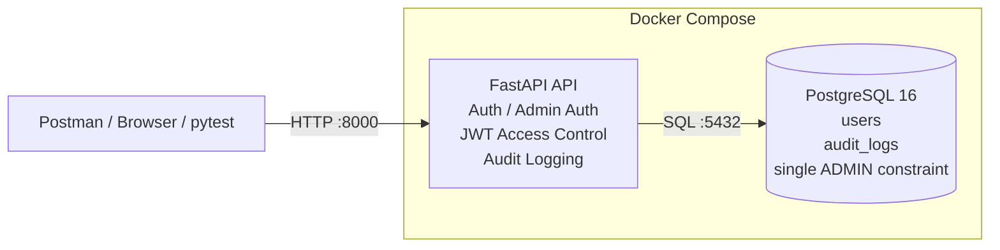

# Technical QA Lab - 테스트 환경 구축 및 실행 가이드

## 1. 문서 목적

이 문서는 `Technical QA Lab` 프로젝트의 테스트 환경을 **왜 이렇게 구성했는지**, 어떤 순서로 구축했는지, 그리고 다른 PC에서 Git 저장소를 받은 뒤 **동일한 테스트 환경을 재현하는 방법**을 정리한 문서입니다.

프로젝트의 목적은 백엔드 서비스를 크게 개발하는 것이 아니라, Technical QA 관점에서 다음 항목을 직접 검증할 수 있는 최소 테스트 대상을 만드는 것입니다.

- API 요청/응답 검증
- 인증 및 접근통제 검증
- 사용자 상태에 따른 동작 검증
- PostgreSQL 데이터 상태 교차검증
- Audit Log 검증
- 정상/예외/권한 시나리오 테스트
- 반복 가능한 테스트 환경 구성

---

## 2. 구축 목표

초기에는 FastAPI를 Windows의 Python 가상환경에서 직접 실행하고 PostgreSQL만 Docker로 실행했습니다.

```text
[초기 환경]

Windows
├─ Python .venv
│  └─ FastAPI / Uvicorn
│
└─ Docker
   └─ PostgreSQL
```

하지만 이 방식은 다른 PC에서 테스트할 때 Python 버전, 패키지 설치 상태, PostgreSQL 환경 등에 따라 차이가 발생할 수 있습니다.

따라서 최종적으로 다음과 같이 변경했습니다.

```text
[최종 환경]

Docker Compose
├─ FastAPI API Container
└─ PostgreSQL 16 Container
```

사용자는 Git 저장소를 받은 후 PowerShell에서 `setup.ps1`을 실행하여 환경을 구성할 수 있도록 했습니다.

---

## 3. 환경 아키텍처

GitHub에서는 아래 Mermaid 다이어그램이 자동으로 렌더링됩니다.



### 주요 구성 요소

| 구성 요소 | 역할 |
|---|---|
| FastAPI | 테스트 대상 API 제공 |
| PostgreSQL 16 | 계정 및 Audit Log 데이터 저장 |
| Docker | 실행 환경 격리 |
| Docker Compose | API와 DB를 동일한 구성으로 실행 |
| Postman | API 정상/예외/권한 시나리오 검증 |
| Swagger | 공개 API 구조 확인 및 Smoke Test |
| JWT | 관리자 API 인증 및 접근통제 |
| bcrypt | 비밀번호 해시 처리 |
| PowerShell | 테스트 환경 초기 구축 자동화 |

---

## 4. 각 기술을 사용한 이유

### Docker / Docker Compose

로컬 PC에 Python과 PostgreSQL을 직접 구성하면 PC마다 환경 차이가 발생할 수 있습니다. 따라서 API와 DB를 컨테이너화하여 테스트 환경의 재현성을 확보했습니다.

### PostgreSQL

API 응답만 확인하는 것이 아니라 실제 DB에 저장된 값과 데이터 제약조건까지 교차검증하기 위해 사용했습니다.

주요 검증 대상:

- `username` UNIQUE
- `role` CHECK
- `status` CHECK
- ADMIN 최대 1명 제약
- 계정 상태
- Audit Log 저장 여부

### FastAPI

QA 포트폴리오에서 직접 검증할 수 있는 최소 API 테스트 대상을 빠르게 구성하기 위해 사용했습니다. 이 프로젝트에서 FastAPI 개발 자체가 목적은 아닙니다.

### Postman

Swagger만으로는 JWT Header, 잘못된 토큰, 만료 토큰, 권한별 요청 등 다양한 테스트 시나리오를 관리하기 어렵기 때문에 실제 테스트 실행은 Postman을 중심으로 수행합니다.

### Audit Log

API가 단순히 401/403을 반환하는지만 보는 것이 아니라 인증 및 접근 거부 이벤트가 DB에 기록되는지도 검증하기 위해 구성했습니다.

현재 기록 이벤트:

- `LOGIN_SUCCESS`
- `LOGIN_FAILED`
- `ACCESS_DENIED`

---

## 5. 구축 과정

### Step 1. 프로젝트 기본 구조 구성

```text
technical-qa-lab/
├─ app/
├─ db/
├─ docs/
├─ tests/
└─ docker-compose.yml
```

### Step 2. PostgreSQL Docker 환경 구성

PostgreSQL 16 이미지를 사용하여 DB 컨테이너를 먼저 구성했습니다. 초기에는 FastAPI는 Windows에서 실행하고 PostgreSQL만 Docker에서 실행했습니다.

### Step 3. DB Schema 구성

```text
db/
├─ 01_create_users.sql
├─ 02_create_audit_logs.sql
└─ 03_enforce_single_admin.sql
```

- `01_create_users.sql`: 사용자 계정 테이블 생성
- `02_create_audit_logs.sql`: 로그인/접근 거부 이벤트 저장 테이블 생성
- `03_enforce_single_admin.sql`: 두 번째 ADMIN 생성 차단

> 단일 ADMIN 제약은 ADMIN을 **최대 1명**으로 제한합니다.

### Step 4. USER / ADMIN 정책 분리

```text
USER  → /auth/login
ADMIN → /admin/auth/login
```

ADMIN은 일반 USER 로그인 API를 사용할 수 없습니다. 일반 사용자 생성 과정에서는 역할을 입력할 수 없으며 생성되는 계정은 USER로 제한했습니다.

### Step 5. ADMIN JWT 인증 구성

관리자 로그인 성공 시 JWT를 발급하도록 구성했습니다. 관리자 API는 유효한 ADMIN JWT가 있어야 접근할 수 있습니다.

검증 대상:

- 토큰 없음
- 잘못된 토큰
- 만료된 토큰
- 정상 ADMIN 토큰

### Step 6. Audit Log 구성

인증 및 접근 거부 이벤트를 PostgreSQL의 `audit_logs` 테이블에 기록하도록 구성했습니다.

### Step 7. FastAPI Docker화

기존에는 로컬 `.venv`에서 FastAPI를 실행했지만 재현 가능한 환경을 위해 FastAPI도 Docker Container로 변경했습니다.

추가 파일:

```text
Dockerfile
requirements.txt
.dockerignore
```

### Step 8. FastAPI + PostgreSQL 통합

`docker-compose.yml`에서 다음 두 서비스를 함께 관리하도록 변경했습니다.

```text
services
├─ db
└─ api
```

FastAPI Container는 PostgreSQL Health Check가 성공한 뒤 시작합니다.

### Step 9. DB 자동 초기화

새 PostgreSQL Volume이 생성될 때 다음 SQL 파일이 순서대로 실행됩니다.

```text
01_create_users.sql
        ↓
02_create_audit_logs.sql
        ↓
03_enforce_single_admin.sql
```

그 후 API Container에서 `db.init_admin`을 실행하여 초기 ADMIN을 생성하고 FastAPI를 시작합니다.

> PostgreSQL의 `/docker-entrypoint-initdb.d` 스크립트는 **새 DB Volume의 최초 초기화 시점에 실행**됩니다.

### Step 10. PowerShell 자동 구축 스크립트 구성

`setup.ps1`은 다음 작업을 수행합니다.

```text
Docker 설치/실행 확인
        ↓
.env 존재 여부 확인
        ↓
.env가 없으면 신규 생성
        ↓
DB 비밀번호 자동 생성
ADMIN 비밀번호 자동 생성
JWT Secret 자동 생성
        ↓
docker compose up -d --build
        ↓
DB / API 실행
        ↓
/db-health 확인
        ↓
환경 구축 완료
```

---

## 6. 현재 프로젝트 구조

```text
technical-qa-lab/
├─ app/
│  ├─ main.py
│  ├─ database.py
│  ├─ audit.py
│  ├─ security.py
│  └─ routers/
│
├─ db/
│  ├─ 01_create_users.sql
│  ├─ 02_create_audit_logs.sql
│  ├─ 03_enforce_single_admin.sql
│  └─ init_admin.py
│
├─ docs/
│  ├─ 00_project_plan.md
│  ├─ 01_requirements.md
│  └─ 02_environment_setup.md
│
├─ tests/
├─ Dockerfile
├─ docker-compose.yml
├─ requirements.txt
├─ setup.ps1
├─ .env.example
├─ .dockerignore
└─ .gitignore
```

---

## 7. 다른 PC에서 처음 실행하는 방법

이 절은 **학원 PC 또는 새로운 PC에서 실제 신규 설치를 검증할 때 사용하는 순서**입니다.

### 7-1. 사전 준비

필수 프로그램:

1. Git
2. Docker Desktop
3. PowerShell

Python이나 PostgreSQL을 PC에 직접 설치할 필요는 없습니다.

### 7-2. Docker Desktop 실행

Docker Desktop을 실행하고 Docker Engine이 정상적으로 실행되는지 확인합니다.

```powershell
docker --version
```

### 7-3. Git 저장소 Clone

```powershell
git clone <repository-url>
cd technical-qa-lab
```

Private Repository라면 GitHub 인증이 필요할 수 있습니다.

### 7-4. 신규 Clone 상태 확인

GitHub에는 실제 `.env`가 올라가지 않기 때문에 신규 Clone 상태에서는 `.env`가 없어야 정상입니다.

```powershell
Test-Path .env
```

정상적인 신규 Clone이라면:

```text
False
```

가 출력됩니다.

### 7-5. PowerShell 자동 구축 실행

```powershell
.\setup.ps1
```

PowerShell 실행 정책 때문에 차단되는 경우, 현재 PowerShell Process에서만 실행 정책을 허용합니다.

```powershell
Set-ExecutionPolicy -Scope Process -ExecutionPolicy RemoteSigned
```

다시 실행:

```powershell
.\setup.ps1
```

### 7-6. 최초 ADMIN 비밀번호 기록

신규 환경에서는 `setup.ps1`이 다음 값을 자동 생성합니다.

- PostgreSQL Password
- ADMIN Password
- JWT Secret

ADMIN Password는 초기 실행 화면에 표시되므로 Postman 테스트에 사용할 수 있도록 별도로 기록합니다.

> 실제 비밀번호와 JWT Secret은 GitHub에 Commit하지 않습니다.

---

## 8. 자동 구축 후 확인 순서

### 8-1. Container 상태 확인

```powershell
docker compose ps
```

정상 예시:

```text
technical-qa-db    Up (healthy)
technical-qa-api   Up
```

### 8-2. DB 연결 Health Check

```powershell
Invoke-RestMethod http://127.0.0.1:8000/db-health
```

정상 결과 예시:

```text
status   : ok
database : qa_lab
user     : qa_user
```

이 결과가 정상이라면 다음 연결이 확인된 것입니다.

```text
PC
 ↓
FastAPI Container
 ↓
PostgreSQL Container
```

### 8-3. Swagger 확인

브라우저에서 접속:

```text
http://127.0.0.1:8000/docs
```

현재 관리자 API는 Swagger Schema에서 숨겨져 있으므로 일반 공개 API만 표시되는 것이 정상입니다.

### 8-4. ADMIN 로그인 확인

관리자 인증은 Postman에서 확인합니다.

```text
POST /admin/auth/login
```

초기 실행 시 생성된 ADMIN 계정 정보를 사용합니다. 정상 로그인 시 ADMIN JWT가 반환됩니다.

---

## 9. PC 신규 환경 검증 체크리스트

- [ ] Git Clone 성공
- [ ] Clone 직후 `.env` 없음
- [ ] `setup.ps1` 실행 성공
- [ ] `.env` 자동 생성
- [ ] PostgreSQL Container 실행
- [ ] PostgreSQL Health Check 정상
- [ ] FastAPI Container 실행
- [ ] `users` Table 자동 생성
- [ ] `audit_logs` Table 자동 생성
- [ ] ADMIN 최대 1명 제약 생성
- [ ] `admin01` 초기화
- [ ] `/db-health` 응답 정상
- [ ] Swagger 접속 가능
- [ ] ADMIN 로그인 가능
- [ ] ADMIN JWT 발급 가능

모두 확인되면 다음 내용을 검증했다고 볼 수 있습니다.

> Git Repository Clone 후 PowerShell 초기화 스크립트 실행만으로 Docker 기반 API/DB 테스트 환경을 재현할 수 있음.

---

## 10. 환경 종료 및 재실행

### 일시 정지

데이터를 유지하면서 Container만 중지합니다.

```powershell
docker compose stop
```

### 다시 실행

```powershell
docker compose start
```

또는 설정 변경 후:

```powershell
docker compose up -d
```

### Container 제거

```powershell
docker compose down
```

일반적인 `down`은 Container와 Network를 제거하지만 Named Volume은 유지합니다.

### 주의: DB 데이터까지 삭제

```powershell
docker compose down -v
```

`-v` 옵션은 PostgreSQL Volume을 삭제하므로 기존 계정, Audit Log 등 테스트 데이터가 삭제됩니다.

**DB 초기화를 명확하게 의도한 경우에만 사용합니다.**

---

## 11. 문제 발생 시 확인 방법

### API Container가 바로 종료되는 경우

```powershell
docker compose ps -a
```

종료되어 있다면:

```powershell
docker compose logs api
```

### DB Log 확인

```powershell
docker compose logs db
```

### 전체 Log 확인

```powershell
docker compose logs
```

### 8000 또는 5432 Port 충돌

```powershell
docker ps
```

기존 환경이 이미 실행 중이라면 같은 Port를 사용하는 두 번째 환경을 동시에 실행할 수 없습니다.

---

## 12. 환경변수 및 보안 관리

실제 환경변수는 `.env`에 저장합니다.

```text
POSTGRES_USER
POSTGRES_PASSWORD
POSTGRES_DB
ADMIN_USERNAME
ADMIN_PASSWORD
JWT_SECRET_KEY
```

`.env`는 GitHub에 업로드하지 않습니다.

GitHub에는 구조만 설명하는 `.env.example`을 제공합니다.

또한 `.dockerignore`를 사용하여 `.env`가 Docker Image에 포함되지 않도록 구성했습니다.

---

## 13. 현재 검증된 기능

### USER 로그인

| Scenario | Expected |
|---|---|
| ACTIVE USER + 정상 비밀번호 | 200 |
| INACTIVE USER + 정상 비밀번호 | 403 |
| 잘못된 비밀번호 | 401 |
| 존재하지 않는 USER | 401 |
| ADMIN의 일반 USER 로그인 | 401 |

### ADMIN 인증/접근통제

| Scenario | Expected |
|---|---|
| ADMIN 정상 로그인 | JWT 발급 |
| 관리자 API + 토큰 없음 | 401 |
| 관리자 API + Invalid JWT | 401 |
| 관리자 API + Expired JWT | 401 |
| 관리자 API + 정상 ADMIN JWT | 접근 성공 |

### Audit Log

- LOGIN_SUCCESS 기록
- LOGIN_FAILED 기록
- ACCESS_DENIED 기록
- 실제 요청 Endpoint 기록

### DB 정책

- username UNIQUE
- role CHECK
- status CHECK
- 두 번째 ADMIN 생성 차단

---

## 14. QA 관점에서의 의미

이 환경을 구축한 목적은 복잡한 Backend 개발 경험을 보여주기 위한 것이 아닙니다.

다음과 같은 Technical QA 업무 흐름을 직접 구성하고 검증하기 위함입니다.

```text
Requirement
    ↓
Test Environment
    ↓
API Test
    ↓
Authentication / Authorization Test
    ↓
DB Verification
    ↓
Log Verification
    ↓
Defect / Regression
    ↓
Automation
```

테스트 환경을 Docker Compose로 구성하고 PowerShell을 통해 초기 설정을 자동화함으로써 다른 PC에서도 동일한 조건으로 테스트를 반복할 수 있도록 재현성을 확보했습니다.

---

## 15. 다음 QA 단계

환경 구축 완료 후 다음 순서로 진행합니다.

```text
1. 요구사항 최종 정리
2. 테스트 조건 도출
3. Test Case 설계
4. Postman 테스트 실행
5. DB / Audit Log 교차검증
6. 결함 기록
7. Regression Test
8. 핵심 시나리오 pytest 자동화
9. 테스트 결과 정리
10. README 최종 작성
```

환경 구축 자체는 여기서 기능 추가를 중단하고, 이후 작업은 QA 검증과 결과 정리에 집중합니다.
